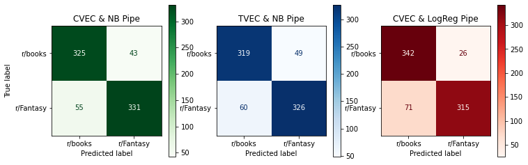

# Project 3 - Web APIs & NLP

**Problem Statement:**

Using NLP to train a model via pipeline on which subreddit a post came from, specifically between r/books and r/Fantasy, we want to determine the best Pipeline Classifiers that dictate a r/Fantasy post.

---
### Datasets

* [`books_cleaned_data.csv`](../data/books_cleaned_data.csv): r/books Subreddit ([source](https://www.reddit.com/r/books/))
* [`fantasy_cleaned_data.csv`](../data/fantasy_cleaned_data.csv): r/Fantasy Subreddit ([source](https://www.reddit.com/r/Fantasy/))
* [`total_cleaned_data.csv`](../data/total_cleaned_data.csv): r/books & r/Fantasy Subreddits

####  Data Dictionary

|Feature|Type|Dataset|Description|
|---|---|---|---|
|**subreddit**|*str*|r/books & r/Fantasy Subreddits|Subreddit|
|**selftext**|*str*|r/books & r/Fantasy Subreddits|Selftext under reddit post|
|**title**|*str*|r/books & r/Fantasy Subreddits|Title of reddit post|
|**total_text**|*str*|r/books & r/Fantasy Subreddits|Title and selftext of reddit post|

---
### Models & Interpretation

CountVectorizer, Multinomial Naive Bayes, TfidVectorizer, Logisitic Regression, and RandomForest have been run in differnet combinations to determine best pipelines utilizing varying hyperparameters.

List of hyperparameters used:
* 'cvec__max_features': [2_000, 3_000]
* 'cvec__min_df': [2, 3]
* 'cvec__max_df': [.9, .95]
* 'cvec__ngram_range': [(1, 1), (1, 2)]
* 'cvec__stop_words': ['english', stopwords] (custom stopwords added under 'stopwords' variable)
* 'tvec__max_features': [2_000, 3_000, 4_000]
* 'tvec__ngram_range': [(1, 1), (1, 2)]
* 'tvec__min_df': [2, 3, 4, 5]
* 'tvec__max_df': [.9, .95]
* 'tvec__stop_words': ['english', stopwords]
* 'logreg__C': [0.01, 0.1, 0.5, 1]
* 'rf__n_estimators': [100, 150, 200]
* 'rf__max_depth': [None, 1, 2, 3, 4, 5]
* 'rf__min_samples_leaf': [2, 4, 6, 8, 10]

Ranking of GridSearch test scores across all models, from highest to lowest:
1. CVEC & NB
    - Train score: 0.8863334807607254
    - **Test score: 0.8713527851458885**
2. CVEC & LogReg
    - Train score: 0.9177355152587351
    - **Test score: 0.8713527851458885**    
3. TVEC & NB
    - Train score: 0.8978328173374613
    - **Test score: 0.8554376657824934**
4. CVEC & RandomForest
    - Train score: 0.9655019902697921
    - **Test score: 0.8328912466843501**

One thing to note is that GridSearch with CVEC & NB (with no NB hyperparameters) has the same test score as CVEC & LogReg (with C hyperparameter)

---
### Conclusion and Recommendations

GridSearching with CountVectorizer and Multinomial Naive Bayes had the best result when classifying r/Fantasy from r/books posts. 
87.14% accuracy vs 51.14% baseline accuracy
Most accurate fit when comparing train and test scores

**Recommendations:** 

Pull data from Horror and SciFi specific subreddits to compare to r/books data. 
Perhaps pull data from before COVID pandemic to determine if people read more due to COVID shutdowns.

---
